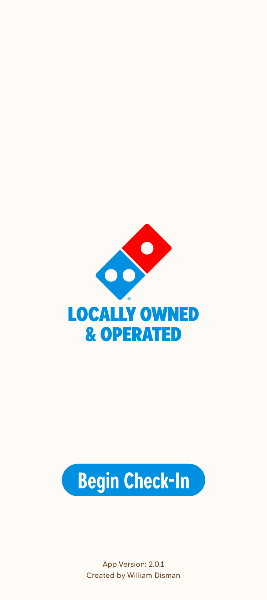
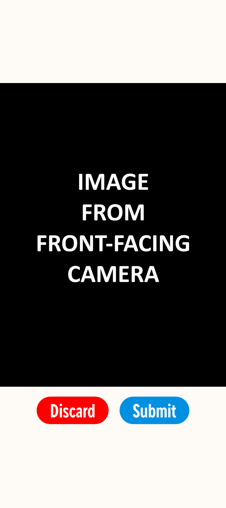
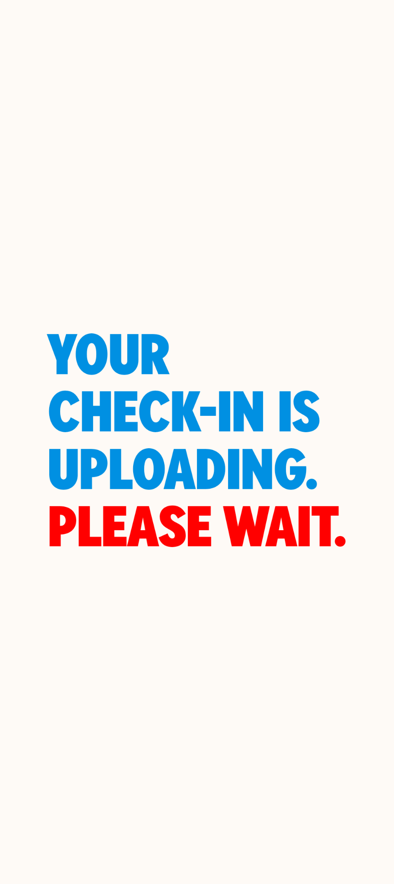

# Uniform Check-In

A Flutter kiosk app built for a single-store Domino's franchise. Employees use the app at the start of a shift to record that they are in uniform and meet all appearance standards. Managers can access these photos to review uniform compliance over the past two weeks. In-store this app runs on a wall-mounted Android tablet. Since introducing this process, violations of uniform and appearance standards have decreased by 70%.

<p align="center">
  
  
  
</p>

## How It Works

1. An employee presses **Begin Check-In** on the home screen.
2. A countdown begins to allow time to step back behind a line on the floor.
3. When the timer is up, the app takes a photo with the tablet's front camera. Simultaneously, it grabs a frame from the store's security camera over RTSP, providing a higher-resolution full-body view.
4. The employee is shown the image from the front-facing camera and given the option to **Submit** or **Discard**.
5. Both images are Base64-encoded and POSTed to a Google Apps Script web app.
6. The web app processes the received data and stores the images named by timestamp in a Google Drive folder.
7. A manager can access the AppSheet interface (not included) and view the check-in submissions during less-busy hours.

If the security camera can't be reached, the front camera photo is duplicated and uploaded in its place, so a check-in still goes through.

## Tech Details

- **Flutter / Dart**
- [`camera`](https://pub.dev/packages/camera): front-camera preview and capture
- [`media_kit`](https://pub.dev/packages/media_kit): plays the RTSP security camera stream and takes a screenshot of it
- [`http`](https://pub.dev/packages/http): uploads the images to the Apps Script endpoint
- Kiosk-friendly setup: portrait orientation is locked, the app runs in immersive full-screen mode, and the back button is blocked while an upload is in progress

## Setup

### 1. Configuration

The Google Apps Script endpoint and credentials are stored separately in a *secrets.json* file that is supplied at build time. Copy *secrets.example.json* to *secrets.json* and fill in the values.

| Key          | Description                                                  |
| ------------ | ------------------------------------------------------------ |
| `SCRIPT_URL` | Deployment URL of the Google Apps Script web app             |
| `SECRET_KEY` | Shared key that the script checks before accepting an upload |
| `CAM_STREAM` | RTSP URL of the security camera, including credentials       |

### 2. Fonts

The brand fonts used in the app are proprietary and not available outside of approved vendors and partners. The *pubspec.yaml* file references fonts not included in this repo. To build successfully, the `fonts:` section must be removed from *pubspec.yaml* unless alternative fonts exist at the same paths as listed.

### 3. Run

```bash
flutter pub get
flutter run --dart-define-from-file=secrets.json
```

## Backend

The Apps Script backend is included in *apps_script.gs*. The following values must be updated for the script to be set up.

| Variable       | Description                                                       |
| -------------- | ----------------------------------------------------------------- |
| `folderId`     | Folder ID of the Google Drive folder where images should be saved |
| `EXPECTED_KEY` | Shared key that the script checks before accepting an upload      |

`EXPECTED_KEY` must match `SECRET_KEY` defined in *secrets.json*. After deploying the script, the web app URL should be used as `SCRIPT_URL` in *secrets.json*.

The script also includes a `deleteOldFiles()` function that can be called using a time-based trigger to clean up images older than two weeks.

**Expected Payload:**
```json
{
  "filename": "2026-01-01T09_00_00",
  "mimeType": "image/jpeg",
  "image": "<base64 front-camera photo>",
  "cam": "<base64 security-camera frame>",
  "secretKey": "<SECRET_KEY>"
}
```

## Future Considerations

Currently, the plan is to migrate the backend and manager view to Node.js and React by the end of 2026 to improve scalability and reduce reliance on third-party services.

## Legal Notice

This is an independent project built for a single franchise location. It is not affiliated with, endorsed by, or sponsored by Domino's Pizza, Inc. or its subsidiaries. Domino's, the Domino's logo, and related marks are trademarks of their respective owners and are used here only to show the app as it was deployed.

© 2026 William Disman. All rights reserved.